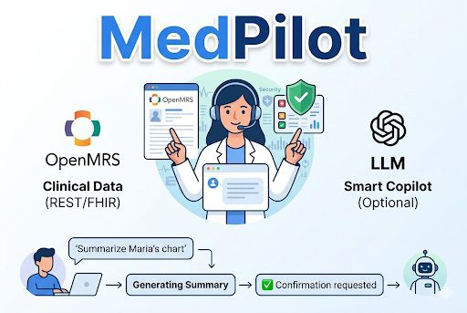
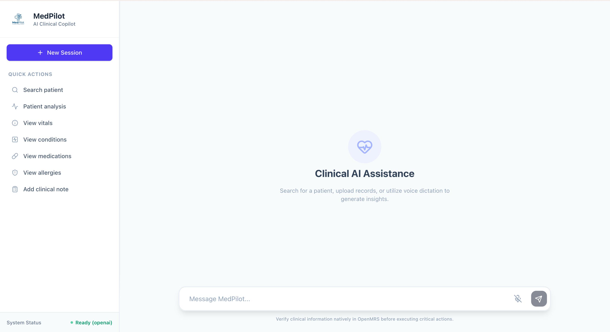
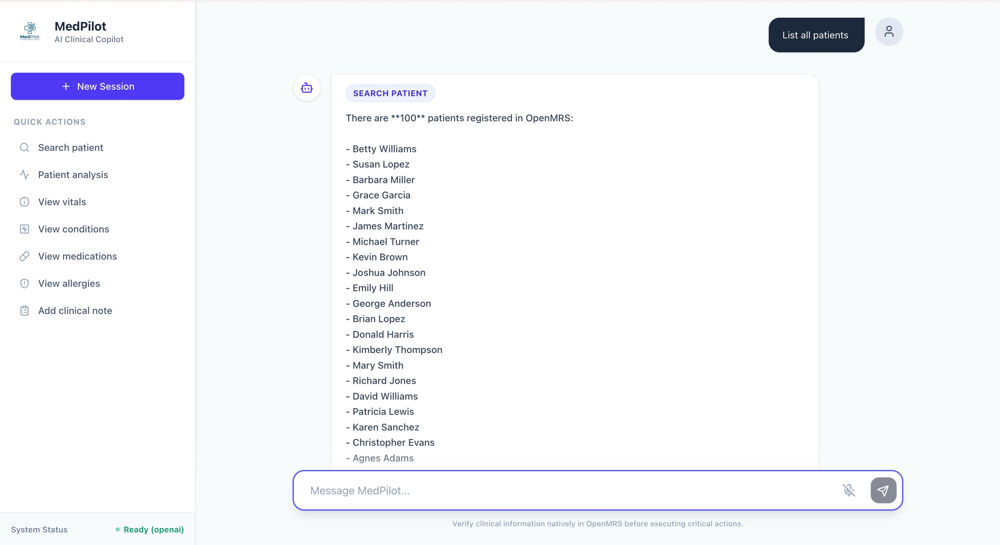
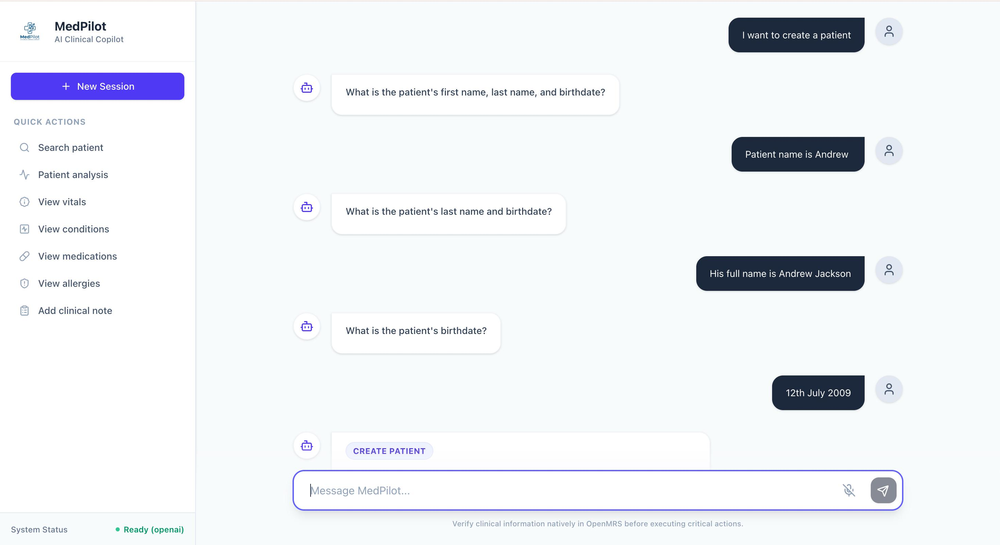
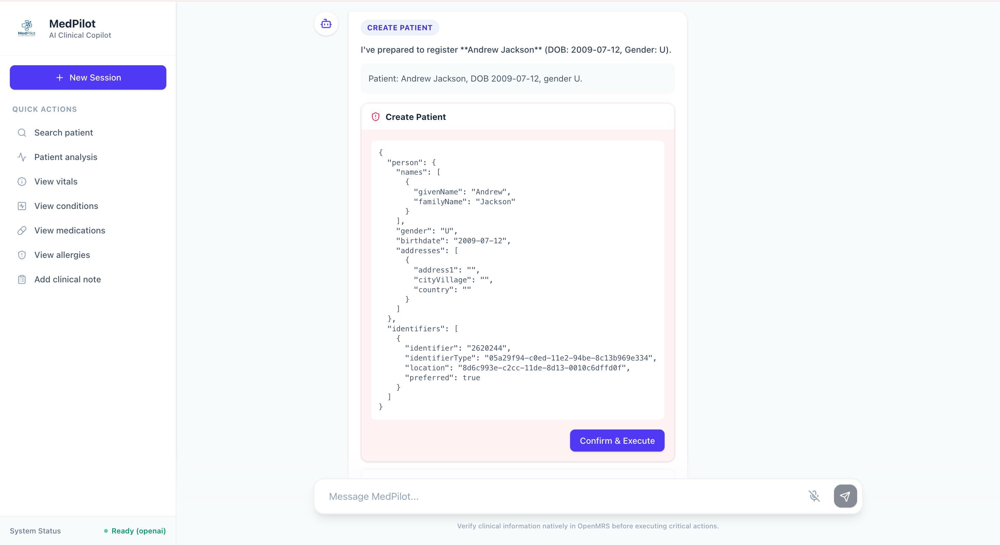

# MedPilot



MedPilot is a chat-first clinical copilot for OpenMRS. It combines a FastAPI backend, a React + Vite browser UI, deterministic intent routing, optional LLM reasoning, and direct OpenMRS REST/FHIR integrations so clinicians can search patients, review charts, record data, and safely prepare write actions from natural-language prompts.

---

## Why this project exists

OpenMRS is powerful, but most clinical workflows still require multiple clicks, context-switching, and careful navigation between modules. MedPilot provides a single conversational workspace that can:

- find the right patient quickly
- hold chart context across follow-up prompts without repeating the patient name
- summarise the chart from live data
- prepare write operations safely before anything is submitted
- expose OpenMRS capabilities through a discoverable, natural-language interface

---

## What is implemented

MedPilot currently supports these workflow groups end-to-end:

**Patient management**
- Search by name, count patients, look up by identifier or UUID
- Register a new patient, update demographics, delete/void a patient
- Switch active chart context within a session
- Patient intake workflow (register + chart data in one step)

**Chart review (read)**
- Clinical summary and analysis
- Vitals and observations
- Conditions / problem list
- Allergies and intolerances
- Medication orders and dispense history
- Encounters and visit history
- Program enrolments
- Available encounter types, drugs, providers, and locations

**Clinical writes (confirmation-gated)**
- Record vitals and observations (height, weight, BP, SpO2, pulse, temperature, glucose, and more)
- Add, update, and remove conditions
- Add, update, and remove allergies
- Prescribe and update medication orders, record medication dispenses
- Create clinical encounters
- Write clinical notes (note, chief complaint, clinical impression, assessment)

**Safety and audit**
- All write operations require explicit user confirmation before execution
- Destructive deletes require typing `DELETE` to proceed
- Role-based permission enforcement
- Append-only audit log for every action

**LLM reasoning (optional)**
- Structured intent extraction and entity resolution
- Multi-turn conversation with active patient context preserved
- Clinical narrative summaries
- Supports OpenAI, Anthropic, and Ollama; gracefully falls back to deterministic classification when no LLM is configured

**Optional integrations**
- Health Gorilla: patient/condition preview and import (requires a sandbox token)

---

## Architecture

### Backend — FastAPI

| Path | Role |
|---|---|
| `app/api/` | HTTP route handlers |
| `app/services/` | Chat orchestration, domain workflows |
| `app/clients/` | OpenMRS REST/FHIR client, Health Gorilla client |
| `app/llm/` | Provider abstraction and implementations (OpenAI, Anthropic, Ollama) |
| `app/models/` | Pydantic request/response/domain models |
| `app/core/` | Audit logging, RBAC, confirmation gates, exceptions |
| `app/main.py` | Application entry point |

### Frontend — React + Vite + Tailwind

The UI lives in `frontend-react/`. During development the Vite dev server proxies all `/api` requests to the FastAPI backend at `localhost:8000`.



### External systems

| System | Role |
|---|---|
| **OpenMRS** | Primary system of record (REST and FHIR2 APIs) |
| **OpenAI / Anthropic / Ollama** | Optional LLM provider for reasoning |
| **Health Gorilla** | Optional external patient/condition import |

---

## Repository structure

```text
.
├── app/
│   ├── api/              # FastAPI route handlers
│   ├── clients/          # OpenMRS and Health Gorilla HTTP clients
│   ├── core/             # Audit, RBAC, confirmation gates, exceptions
│   ├── llm/              # LLM provider abstraction and implementations
│   ├── models/           # Pydantic models (domain and API)
│   ├── services/         # Chat agent and all clinical workflow services
│   └── main.py           # Application entry point
├── frontend-react/       # React + Vite + Tailwind CSS UI
│   ├── src/
│   │   └── App.jsx       # Single-page chat shell
│   └── vite.config.js    # Dev server with /api proxy
├── data/
│   ├── audit/            # Append-only audit log output
│   └── chat/             # Chat session storage
├── Documentation/        # Supporting product and spec documentation
├── openmrs/              # OpenMRS Docker Compose stack and assets
├── tests/                # Python unit tests
├── requirements.txt      # Python dependencies
└── .env.example          # Environment variable template
```

---

## Prerequisites

- Python 3.10 or newer
- Node.js 18 or newer (for the React frontend)
- Docker and Docker Compose (if you want the included OpenMRS stack)
- A running OpenMRS instance (local Docker or remote)
- An LLM provider credential **or** Ollama running locally (optional — deterministic classification still works without one)

---

## Setup

### 1. Python environment

```bash
python3 -m venv .venv
source .venv/bin/activate   # Windows: .venv\Scripts\activate
pip install -r requirements.txt
```

### 2. Environment variables

```bash
cp .env.example .env
```

Edit `.env`. The minimum required settings are:

```env
OPENMRS_BASE_URL=http://localhost:8080/openmrs
OPENMRS_USERNAME=admin
OPENMRS_PASSWORD=Admin123
```

All other settings are optional. See the [LLM configuration](#llm-configuration) section below.

### 3. Start OpenMRS

**Option A — existing instance**: point `OPENMRS_BASE_URL` and credentials in `.env` at your running server.

**Option B — included Docker stack**:

```bash
cd openmrs
docker compose up -d
```

> The provided `docker-compose.yml` expects a MySQL database named `openmrs` already reachable from the containers at `host.docker.internal` with username `root` / password `password`. If that database is not present, either adapt the compose file to include MySQL or use an existing OpenMRS instance.

Default ports after startup:
- OpenMRS frontend: `http://localhost`
- OpenMRS backend API: `http://localhost:8080/openmrs`

### 4. Start the backend

```bash
uvicorn app.main:app --reload --host 127.0.0.1 --port 8000
```

Interactive API docs: `http://127.0.0.1:8000/docs`

### 5. Start the frontend

```bash
cd frontend-react
npm install
npm run dev
```

Open the UI at the URL printed by Vite (default `http://localhost:5173`).

---

## LLM configuration

Without an LLM provider, common patterned prompts work via the built-in deterministic classifier, but free-form intent extraction and clinical narrative summaries require a provider.

### OpenAI

```env
MEDPILOT_LLM_PROVIDER=openai
MEDPILOT_LLM_MODEL=gpt-4o-mini
OPENAI_API_KEY=sk-...
```

### Anthropic

```env
MEDPILOT_LLM_PROVIDER=anthropic
MEDPILOT_LLM_MODEL=claude-haiku-4-5
ANTHROPIC_API_KEY=sk-ant-...
```

### Ollama (local)

```env
MEDPILOT_LLM_PROVIDER=ollama
MEDPILOT_LLM_MODEL=qwen2.5:14b
OLLAMA_BASE_URL=http://localhost:11434/api
```

### Optional tuning knobs

```env
MEDPILOT_LLM_ENABLE_INTENT_REASONING=true
MEDPILOT_LLM_ENABLE_SUMMARY_REASONING=true
MEDPILOT_LLM_TIMEOUT_SECONDS=30
MEDPILOT_LLM_MAX_OUTPUT_TOKENS=2000
MEDPILOT_LLM_REASONING_EFFORT=medium
```

---

## End-to-end walkthrough

### 1. Confirm the app is healthy

```bash
curl http://127.0.0.1:8000/api/health
curl http://127.0.0.1:8000/api/llm/status
```

### 2. Find and load a patient

```
Find patient Maria Santos
Find patient with id 10001D
List all patients
How many patients are there?
Open chart for John Doe
```



### 3. Review the chart

```
Summarize this patient
Show their vitals
Show their conditions
Show their allergies
Show their medications
Show encounters for this patient
Show visits for this patient
```

### 4. Write to the chart (confirmation-gated)

All writes show a preview card with the exact payload. Click **Confirm & Execute** to apply.

```
Record blood pressure 140/90 for this patient
Record height 172 cm for this patient
Record SpO2 98% and pulse rate 76 for this patient
Add condition Fever for this patient
Add penicillin allergy, moderate severity, reaction rash
Prescribe paracetamol 500 mg oral twice daily for 5 days
Add note for this patient: Follow-up for chest pain
```

MedPilot guides you through multi-turn creation flows conversationally:



Before any write is executed, MedPilot shows you the exact payload and waits for your confirmation:



### 5. Inspect audit output

Every action is logged to `data/audit/audit.log`. Session artifacts are stored under `data/chat/sessions/`.

---

## API overview

FastAPI exposes interactive docs at `/docs`. Key endpoints:

| Method | Path | Description |
|---|---|---|
| `GET` | `/api/health` | App health check |
| `GET` | `/api/llm/status` | Active LLM provider status |
| `POST` | `/api/chat` | Primary chat endpoint (supports `patient_uuid`, `history`, optional file upload) |
| `POST` | `/api/chat/confirm` | Confirm a pending write action |
| `POST` | `/api/intent` | Direct intent classification |
| `POST` | `/api/patients/search` | Patient search |
| `GET` | `/api/patients/{uuid}/summary` | Structured patient summary |
| `GET` | `/api/observations/{uuid}` | List patient observations |
| `POST` | `/api/observations` | Create observation |
| `PUT` | `/api/observations` | Update observation |
| `DELETE` | `/api/observations/{id}` | Delete observation |
| `GET` | `/api/conditions/{uuid}` | List conditions |
| `POST` | `/api/conditions` | Create condition |
| `PATCH` | `/api/conditions/{id}` | Update condition status |
| `DELETE` | `/api/conditions/{id}` | Delete condition |
| `GET` | `/api/allergies/{uuid}` | List allergies |
| `POST` | `/api/allergies` | Create allergy |
| `PATCH` | `/api/allergies/{id}` | Update allergy severity |
| `DELETE` | `/api/allergies/{id}` | Delete allergy |
| `GET` | `/api/medications/{uuid}` | List medication requests |
| `POST` | `/api/medications` | Create medication order |
| `PATCH` | `/api/medications/{id}` | Update medication status |
| `GET` | `/api/medications/{uuid}/dispense` | List medication dispenses |
| `POST` | `/api/medications/dispense` | Create medication dispense |
| `POST` | `/api/encounters` | Create encounter |

### Example chat request

```bash
curl -X POST http://127.0.0.1:8000/api/chat \
  -F "prompt=Find patient Maria Santos"
```

---

## Safety model

MedPilot enforces safety at multiple layers:

| Layer | Mechanism |
|---|---|
| **Permissions** | `app/core/security.py` checks the actor's role before every read and write |
| **Confirmation gates** | Write actions return a pending payload; nothing is submitted until the user confirms |
| **Destructive safeguard** | Delete operations require typing `DELETE` in the confirmation prompt |
| **Audit logging** | Every action is recorded in an append-only log with field-level redaction |
| **Patient context** | Active patient UUID is threaded through every request to prevent cross-patient writes |

---

## Testing

```bash
PYTHONPATH=. pytest -q
```

If you see `ModuleNotFoundError: No module named 'app'` the repo root is not on `PYTHONPATH`.

Run just the deterministic classifier smoke test:

```bash
python test_classifier.py
```

---

## Useful commands

```bash
# Install Python dependencies
pip install -r requirements.txt

# Start backend (hot-reload)
uvicorn app.main:app --reload

# Start frontend dev server
cd frontend-react && npm run dev

# Start OpenMRS Docker stack
cd openmrs && docker compose up -d

# Run tests
PYTHONPATH=. pytest -q
```

---

## Troubleshooting

**UI shows "Offline" or "LLM Not Configured"**
The app started but the LLM provider is disabled or credentials are missing. Check `MEDPILOT_LLM_PROVIDER`, the corresponding API key, and `MEDPILOT_LLM_MODEL`. Common free options: Ollama running locally with `MEDPILOT_LLM_PROVIDER=ollama`.

**OpenMRS requests fail**
Verify `OPENMRS_BASE_URL`, username, and password. Confirm the OpenMRS server is reachable and that the FHIR2 and REST modules are enabled.

**Docker OpenMRS starts but the backend container errors**
The bundled compose file assumes a host-side MySQL database named `openmrs`. Without it the OpenMRS WAR will not initialise. Either add MySQL to the compose file or point MedPilot at an existing OpenMRS instance.

**Observation creation returns 400**
Confirm the OpenMRS instance has the CIEL concept dictionary loaded. MedPilot references CIEL concept UUIDs for all standard vital signs.

---

## Development notes

- Session state is file-backed (JSON under `data/chat/sessions/`), not database-backed.
- Audit logs are append-only text records with basic field redaction.
- The deterministic classifier in `app/services/deterministic_classifier.py` handles common phrases without an LLM round-trip.
- All clinical writes go through the pending-action confirmation flow defined in `app/core/confirmation.py`.

---

## License

Distributed under the GNU General Public License v3. See `LICENSE` for details.
